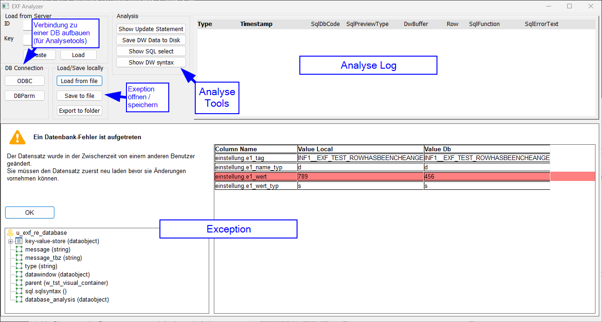

# Informaticon Exception Framework

Informaticon Exception Framework (EXF) helps to streamline the management of exceptions/runtimeerrors in PowerBuilder.
In this documentation, the term "exception" is used to describe both exceptions and runtimeerrors.

## Features
* Simplified exception creation
* Meaningful and user-friendly error messages
* Additional error types to store arbitrary data (context information)
* Automatic stack trace determination
* Serialisation and deserialisation of exceptions
* Error analysis using EXF Analyzer

## Screenshot


## Usage
A more detailed documentation in German can be found [here](docs/RADME.md).
To use the Exception Framework, you must instantiate it globally in your application object:

```powerbuilder
// Global variables
u_exf_error_manager gu_e

// open() event
gu_e = create u_exf_error_manager
```

### Throwing exceptions

```powerbuilder
throw(gu_e.iu_as.of_ex(gu_e.of_new_error('Connection timed out')))
```

### Adding context

You can store any kind of value in an exception. Some are serialised automatically, for others you have to extend `u_exf_application_adapter.of_parse_to_blob()` or to program the object's `of_to_string()` function.

```powerbuilder
datastore lds
string ls_description
u_my_class lu
//...

throw(gu_e.iu_as.of_ex(gu_e.of_new_error('Connection timed out') &
    .of_push('description', ls_description) &
    .of_push('lu', lu) &
    .of_push('lds', lds) &
))
```

### Displaying exceptions

```powerbuilder
try
    //...
catch(u_exf_ex lu_e)
    gu_e.of_display()
end try
```

### Translation / Customisation

The idea is not to change EXF classes directly, but to use an adapter object to override certain behaviour.
To do this, you need to implement an adapter class derived from `u_exf_application_adapter` and register it during application startup:

```powerbuilder
// open() event, after gu_e = create u_exf_error_manager
u_demo_exf_adapter lu_adapter
lu_adapter = create u_demo_exf_adapter

gu_e.of_set_app_adapter(lu_adapter)
```


There are several predefined functions that you can override, the most important are:

| function | purpose |
| ------------- | ------------- |
| of_get_text | Translation, is called for each text displayed by EXF (e.g. 14947->'Cancel'). |
| of_parse_to_blob  | Is called whenever EXF wants to serialise an object (toString-function). |
| of_spawn_window  | Is called whenever EXF wants to display a window. |

### Built-in exception types


blue=checked exceptions (must be caught)  
red=unchecked exceptions (aka runtime errors)

| class | description |
| ------------- | ------------- |
| exception | Predefined exception of the PowerBuillder |
| u_exf_ex | Default checked exception of EXF, you should use this instead of exception |
| u_exf_ex_io | Expected error during input and output (e.g. if fileopen() fails) |
| u_exf_ex_pbni | PowerBuilder Extensions (functions in C++) can/should throw this exception type (see Informaticon PBNI Framework) |
| u_exf_ex_webrequest | Errors that can occur when sending, receiving and processing requests in Internet protocols such as HTTP, HTTPS, FTP etc. |
| runtimeerror | Predefined unchecked exception of the PowerBuilder |
| u_exf_re | Unchecked exception of the EXF, you should use this instead of runtimeerror |
| u_exf_re_database | Database error or error in a Datawindow or Datastore |
| u_exf_re_illegalargument | Can be thrown if the arguments passed to a function do not meet the requirements (e.g. if an argument is unauthorised NULL, or a long must not be <= 0) |
| u_exf_re_invalidstate | Can be thrown if an object has entered an invalid (inconsistent) state
| u_exf_re_io | Unexpected error during input and output (e.g. if fileclose() fails) |
| u_exf_re_notimplemented | For the implementation of abstract classes (e.g. you want to force the developer to overwrite a certain function and therefore throw such an unchecked exception in the base class) |
| u_exf_re_systemerror | Should only be thrown in the application's systemerror event |

## EXF Analyzer
With the help of the Exception Framework, error analysis capabilities are greatly improved thanks to context information and exception nesting.
Data required for error analysis can be saved in the exception and displayed elsewhere in your software.

The aim of the "EXF Analyzer" is to enable supporters/developers to analyse the context information retrospectively and to help debugging database errors that happended at runtime.
Exceptions that occured at runtime can be stored using the save button and later loaded into EXF Analyzer (Load from file).



## How to build

### Requirements
Most of the build requirements can be installed using [choco](https://community.chocolatey.org/packages/make).
* Build tools (if you don't want to build manually)
    * Make (`choco install make`)
    * act (`choco install act-cli`)
* PowerBuilder
    * PowerBuilder Compiler (pbcXXX.exe / PBAutoBuild250.exe)
    * pbmanager (needed to convert PB Solution to PB 2022R3, can be downloaded from there: https://github.com/informaticon/win-pbmanager)
* DLL
    * CMake (`choco install cmake`)
    * Microsoft Visual C++ Build Tools (e.g. from [MS Visual Studio 2022 Community Edition](https://visualstudio.microsoft.com/de/vs/community/))

## How to contribute

Please read [CONTRIBUTING.md](CONTRIBUTING.md) before sending a pull request.

## Related work

Part of the code for the stacktrace function was kindly made available under the MIT licence by [Jeremy Lakeman](https://github.com/lakeman/fastfuncs).
