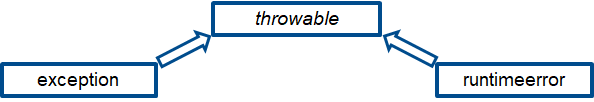
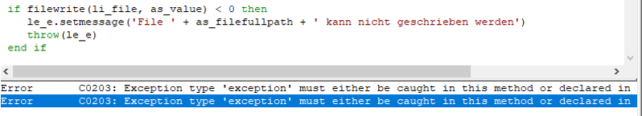
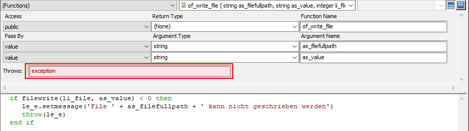
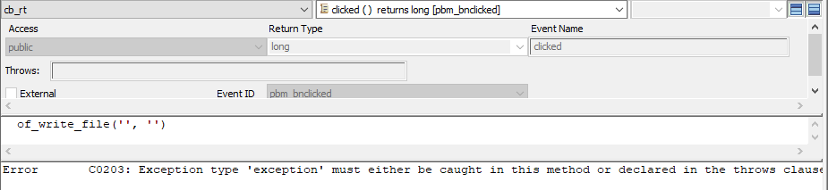
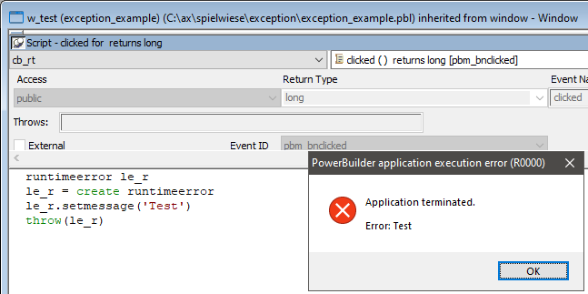
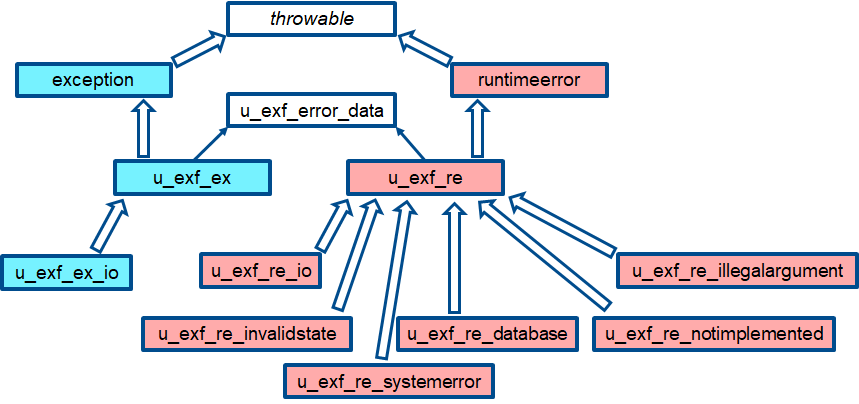
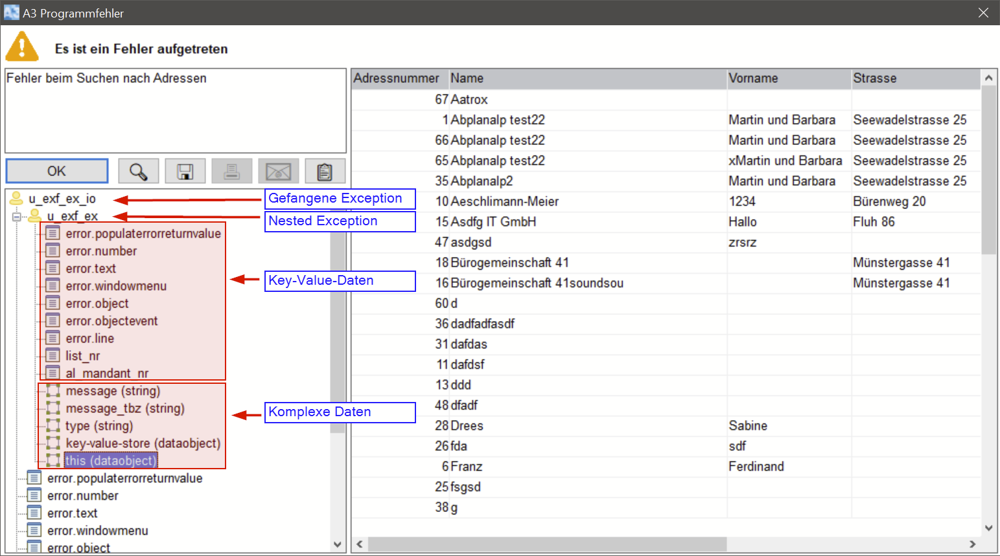
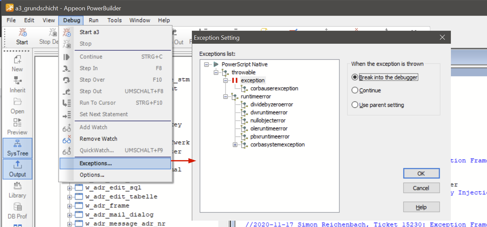

# Überblick

Diese Anleitung soll

- Entwickler, welche noch nicht gross mit dem Thema Exception Handling zu tun hatten, an das Thema heranführen und
- auch erfahrenen Programmierern das von der Informaticon entwickelte Exception Framework erklären.

Weiterführende Dokumente

- [PowerBuilder Referenz: Try...Catch](https://docs.appeon.com/pb2017r3/powerscript_reference/ch07s16.html)
- [Wikipedia: Ausnahmebehandlung](https://de.wikipedia.org/wiki/Ausnahmebehandlung)

## Grundlagen

> "Eine Ausnahme oder Ausnahmesituation (englisch exception oder Trap) bezeichnet in der Computertechnik ein Verfahren, Informationen über bestimmte Programmzustände – meistens Fehlerzustände – an andere Programmebenen zur Weiterbehandlung weiterzureichen.
> [...]
> Exceptions haben in weiten Teilen die Behandlung von Fehlern mittels Fehlercodes oder Sprunganweisungen abgelöst und stellen im technischen Sinne einen **zweiten, optionalen Rückgabewert** einer Methode / Funktion dar." - Wikipedia

### Idee

- Business-Logik und Ausnahmebehandlung sollen möglichst voneinander getrennt werden.
- Die Ausnahme wird nicht zwingend dort behandelt, wo sie aufgetreten ist.
- Neben einer Fehlermeldung, können auch weitere Kontextinformationen angezeigt und so das Debuggen erleichtert werden. Dadurch wird die Fehlersuche erleichtert.

Eine Ausnahme kann geworfen (throw) und abgefangen (catch) werden.
Um eine potentielle Ausnahme zu ermöglichen, sollte der jeweilige Code von einem try-Block umschlossen werden.

Eine Ausnahme ist im PowerBuilder immer ein Objekt, welches von throwable erbt.



Vordefiniert sind im PowerBuilder ausserdem die beiden Objekte  
`exception` (=checked exception) und  
`runtimeerror` (=unchecked exception).

### try...catch

```powerbuilder
try
	//Code, welcher unter Umständen Ausnahme werfen könnte
	exception le_allesschlecht
	le_allesschlecht = create le_allesschlecht
	throw(le_allesschlecht)
	    
	ls_test = ‘aa’ //wird nie ausgeführt

catch(exception le_1) //throwable-Objekt
	//Problem behandeln, falls eine Ausnahme von Typ exception geworfen wurde

catch(runtimeerror le_2) //anderes throwable-Objekt
	//Problem behandeln, falls eine Ausnahme vom Typ runtimeerror geworfen wurde

end try
```

Exceptions können auch innerhalb eines catch-Blockes geworfen (oder weitergeworfen) werden.

Wenn eine Ausnahme geworfen wird, wird der Code nach dem throw-Statement nicht mehr ausgeführt, sondern versucht, den ersten passenden catch-Block zu finden.

Man kann eine beliebige Anzahl von Catch-Blöcken schreiben, sie funktionieren ähnlich wie ein choose case.

### finally

Nach dem letzten catch-Block (oder auch anstelle eines catch-Blocks) kann man einen finally-Block einfügen.

Egal, ob eine Exception geworfen wurde oder nicht, der Code innerhalb des finally-Blocks wird immer nach den try- und catch-Blöcken ausgeführt, bevor die normale Ausführung fortgesetzt wird.

```powerbuilder
try
    li_file = fileopen(ls_file)
    of_dowat()
    return 2
finally
    //dieser Block wird immer ausgeführt, auch wenn im try-Block wie hier ein return steht
    fileclose(li_file)
end try
```

### checked vs. unchecked exception / exception vs. runtimeerror

Exception ist im PowerBuilder ein Synonym für checked exception.

Runtimeerror ist im PowerBuilder ein Synonym für unchecked exception.

|  | **exception** | **runtimeerror** |
| --- | --- | --- |
| **Synonym** | checked exception | unchecked exception |
| **Bedeutung** | Muss behandelt werden, ansonsten zeigt der Compiler eine Fehlermeldung an. | Muss nicht zwingend behandelt werden, allerdings stürzt dann das A3 ab. |
| **Verwendung** | - Vorhersehbares<br>- Schnittstellen<br>- Exception Handling erzwingen<br>- Behebbare Fehler | - Unvorhergesehenes<br>- Programmierfehler<br>- Schwer behebbare Fehler |

### checked exception

Eine checked exception muss immer behandelt werden, sonst zeigt der PowerBuilder eine Fehlermeldung an:



Anstatt sie mittels catch zu fangen, kann man jedoch auch einfach im Funktionskopf deklarieren, dass man diese exception werfen könnte:



Damit gibt man das "Problem" an den Aufrufer weiter:


### unchecked exception

Eine unchecked exception muss nicht zwingend gefangen werden, allerdings führt sie dann zu einem Programmabsturz:



## Exception Framework

Das Exception Framework (EXF) soll die Arbeit mit Exceptions/RuntimeErrors erleichtern.

Dies wird durch folgende Funktionalitäten erreicht:

- Das EXF führt weitere Exception-Typen ein.
- Das EXF stellt Funktionen zur Verfügung, mit welchen man in nur einer (statt 4) Programmzeile eine Ausnahmen erstellen kann.
- Ausnahmen können mit dem EXF benutzerfreundlich angezeigt und analysiert werden.

Das EXF ist über die globalen Variable `gu_e` verfügbar.

Im nächsten Kapitel werden die verschiedenen Ausnahme-Typen eingeführt, anschliessend wird erklärt, wie man den Inhalt einer Exception/RuntimeError (u_exf_error_data) definiert. Im dritten Kapitel wird das erstellen und werfen von Exceptions/RuntimeErrors erläutert und im letzten Kapitel das Anzeigen und Analysieren von gefangenen Ausnahmen.

### Neue Exceptions/RuntimeErrors



| **Klasse** | **Beschreibung** |
| --- | --- |
| exception | Vordefinierte checked exception des PowerBuillders, bitte nicht verwenden! |
| u_exf_ex | Checked exception des Exception Frameworks, bitte diese anstelle von exception verwenden.<br>Wenn möglich sollte man einen eigenen Exception-Typ verwenden. |
| u_exf_ex_io | Erwartbarer Fehler bei der Ein- und Ausgabe (z.B. wenn fileopen() fehlschlägt). |
| u_exf_ex_pbni | PowerBuilder Extensions (Funktionen in C++) können/sollen diesen Exception Typ werfen |
| u_exf_ex_webrequest | Fehler, welche beim Absetzen, Empfangen und Bearbeiten von Request in Internetprotokollen wie HTTP, HTTPS, FTP usw. auftreten können. |
| runtimeerror | Vordefinierte unchecked exception des PowerBuilders, bitte nicht verwenden! |
| u_exf_re | Unchecked exception des Exception Frameworks, bitte diese anstelle von runtimeerror verwenden. |
| u_exf_re_database | Datenbankfehler oder Fehler in einem Datawindow oder Datastore.<br>Obwohl ein Datenbankfehler oft eine checked exception sein sollte, wird im A3 aus Kompatibilitätsgründen dafür immer eine unchecked exception geworfen.<br>Sollte in der Regel nur vom Framework (inf1) geworfen werden. |
| u_exf_re_illegalargument | Kann geworfen werden, wenn die einer Funktion übergebenen Argumente nicht den Anforderungen entsprechen (z.B. wenn ein Argument unerlaubt NULL ist, oder ein long nicht <= 0 sein darf). |
| u_exf_re_invalidstate | Kann geworfen werden, wenn ein Objekt in einen ungültigen (inkonsistenten) Zustand geraten ist.<br>Dies wäre z.B. der Fall, wenn in zwei Instanzvariablen je ein Array gespeichert würde, welche gleich lang sein müssten und dann z.B. ein 3.Schicht-Entwickler eines der Arrays direkt modifizieren würde, so dass die beiden Arrays nicht mehr gleich lang sind. |
| u_exf_re_io | Unerwarteter Fehler bei der Ein- und Ausgabe (z.B. wenn fileclose() fehlschlägt). |
| u_exf_re_notimplemented | Für die Implementierung von abstrakten Klassen (man will z.B. den Entwickler zwingen, eine bestimmte Funktion zu überschreiben und wirft deshalb in der Basisklasse eine solche unchecked exception). |
| u_exf_re_systemerror | Kann bei bedarf im systemerror-Event geworfen und darf nicht anderweitig verwendet werden. |

### u_exf_error_data

Dies ist sozusagen der "Inhalt" einer Exception/RuntimeError.

Objekte dieses Typs beinhalten die Fehlermeldung, sowie Kontextinformationen und für die Fehleranalyse hilfreiche Objekte.

Mit dem Befehl kann `gu_e.of_new_error()` kann man ein leeres u_exf_error_data-Objekt instanziieren.

Die wichtigsten Funktionen von u_exf_error_data werden hier kurz erläutert.

#### of_get_*()

Alle in u_exf_error_data gespeicherten Informationen sind protected und man kann deshalb nur mittels der Getter-Funktionen darauf zugreifen.

#### of_push()

Fügt eine neue Information hinzu, die Funktion of_push() ist mehrfach [überladen](https://de.wikipedia.org/wiki/Methode_(Programmierung)#%C3%9Cberladen_von_Methoden) und gibt immer eine Referenz auf sich selber zurück (return this).

| **Funktions-Paramter** | **Bemerkung** |
| --- | --- |
| al_populateerrorreturn | Fügt die Daten eines error-Objekts der Exception/RuntimeError hinzu<br>Das error-Objekt ist eine globale Variable, welche mit populateerror(int, string) abgefüllt werden kann und hat nichts mit u_exf_error_data zu tun. |
| as_description, abl_complex_data | Fügt komplexe Daten in Form eines blobs hinzu. Dies sind z.B. Bilder, Dateiinhalte, XML-Daten, JSON-Strings usw. |
| as_description,<br>apo_data | Fügt ein [PowerObject](https://docs.appeon.com/pb2022r3/powerscript_reference/xREF_65210_About_objects.html) hinzu. Mögliche Klassen sind:<br>- Datawindow: Es wird der [komplette Zustand](https://docs.appeon.com/pb2022r3/datawindow_reference/dwmeth_GetFullState.html) des Datawindows hinzugefügt.<br>- Datastore: Es wird der [komplette Zustand](https://docs.appeon.com/pb2022r3/datawindow_reference/dwmeth_GetFullState.html) des Datastores hinzugefügt.<br>- Andere: Es wird versucht, die Funktion `of_to_string()` auszuführen und deren Returnvalue hinzugefügt. Wenn dies fehlschlägt, wird nur der Klassenname gespeichert. |
| as_key,<br>aa_value | Fügt ein Key-Value-Paar hinzu.<br>Der Key muss eindeutig sein, ansonsten werden die bestehenden Daten überschrieben.<br>Limitierung:<br>- as_value darf maximal 256 Zeichen lang sein.<br>- aa_value darf maximal 5000 Zeichen lang sein, es kann sich um einen String, ein Datum/Zeit oder einen numerischen Wert handeln. |
| ... | Weitere of_push()-Varianten sind vorhanden, diese werden hier aber nicht beschrieben. |

#### of_set_message()

Setzt die Fehlermeldung, welche dem Benutzer gezeigt werden soll, falls die Exception angezeigt wird. Gibt immer eine Referenz auf sich selber zurück (return this).

#### of_set_nested_error()

Fügt eine Exception/RuntimeError hinzu. Dies wird benötigt, wenn man z.B. eine u_exf_ex_io fängt und diese verpackt in einer u_exf_re_io wieder werfen will. Anstatt dass man die Daten vom einen ins andere Objekt kopiert, kann man das ganze Objekt in u_exf_re_io hinzufügen (exception nesting genannt). Gibt immer eine Referenz auf sich selber zurück (return this).

#### Kontextinformationen mittels populateerror() hinzufügen

Eines der wichtigsten Informationen, die es im Exception Handling gibt, sind der Funktionsname und die Zeilennummer, in welcher die Ausnahme aufgetreten ist.

Diese Informationen können im PowerBuilder ermittelt werden, in dem man die Funktion `populateerror()` aufruft. Diese speichert die Angaben im globalen Objekt `error`. Das Exception Framework extrahiert diese Daten, wenn man die Funktion `of_push(long al_populateerrorreturn)` aufruft. Die Fehlermeldung (und Fehler-Nummer) kann man als Argument in populateerror mitgeben:

```powerbuilder
gu_e.of_new_error().of_push(populateerror(0, 'Hello world'))
```
### Exception/RuntimeError erstellen und werfen

Im vorherigen Kapitel wurde gezeigt, wie man den Inhalt einer Ausnahme definiert. Nun wird gezeigt, wie man diesen in einer Exception/RuntimeError verpackt und wirft.

Alle durch das Exception Framework definierten Ausnahmen können mittels der Variable `gu_e.iu_as` erstellt werden. Dazu gibt es in `iu_as` für jede Klasse eine eigene Funktion, welche am folgenden Beispiel für `u_exf_re_illegalargument` gezeigt wird.

```powerbuilder
gu_e.iu_as.of_re_illegalargument(gu_e.of_new_error() &
	.of_push(populateerror(0, 'Hello world')) &
)
```

Mittels throw kann diese sodann geworfen werden:

```powerbuilder
throw(gu_e.iu_as.of_re_illegalargument(...))
```

### Exception/RuntimeError anzeigen und analysieren

Eine gefangene Exception kann man mit dem Befehl gu_e.of_display() anzeigen:

```powerbuilder
try
        of_trywat() //throws u_exf_ex
catch(u_exf_ex lu_e)
        gu_e.of_display(lu_e)
        return -1
end try
```
Hier ein Beispiel, wie das Fenster aussieht, wenn man auf die Lupe klickt.



Interessant sind hier vor allem die "error"-Werte, welche das Objekt, Fenster, Event-/Funktionsname und Zeilennummer beinhalten, wo der Fehler aufgetreten ist.

Alle hier angezeigten Informationen kann man auch in eine Datei exportieren.

## Tipps, Tricks und Fallstricke

### Debugging

Man kann beim Debuggen einstellen, dass automatisch ein Break gesetzt wird, wenn irgendwo eine Exception geworfen wird.



### Post

Wenn ein Event oder eine Funktion mittels [post](https://docs.appeon.com/pb2022r3/powerscript_reference/post_func.html) aufgerufen wird und diese eine Exception oder einen RuntimeError wirft, führt dies unweigerlich zu einem Komplettabsturz des A3.

_Deshalb: Nie eine Funktion oder einen Event mittels post aufrufen, wenn diese eine Exception wirft und auch sonst, möglichst sparsam mit post umgehen._

### EXF in eine bestehendes PowerBuilder Projekt integrieren

Die nötigen Schritte sind folgende:

1. Library exf1.pbl zum Target hinzufügen
1. Globale Variable `gu_e` deklarieren und instanziieren
	1. In _inf1.pbl_ => _a3 =>_ _Globale Variablen:_ `u_exf_error_manager gu_e` 
	1. In _inf1.pbl_ => _a3 => Event open():_ `gu_e = create u_exf_error_manager`
1. Error Handler in systemerror-Event definieren:
	1. In _inf1.pbl => a3 => Event systemerror():_

```powerbuilder
// Beispiel
gu_e.of_display(gu_e.of_new_error() &
	.of_set_nested_error(gu_e.of_get_last_error()) &
	.of_push(1 /*populateerror()-Return*/) &
	.of_set_message('systemerror occured') &
	.of_push('Hinweis', 'Achtung: eventuell eingebettete Exceptions müssen nicht zwingend etwas mit diesem Fehler zu tun haben.') &
	.of_set_type('u_exf_re_systemerror'))
halt
```

### Funktion of_to_string()

Um die Fehlerbehandlung zu erleichtern, kann man auf den Userobjects die Funktion of_to_string() mit Returnvalue string implementieren. Diese muss den Inhalt/Zustand des Objekts als String-Repräsentation zurückgeben. Das Exception Framework versucht `of_to_string()` aufzurufen und zeigt den Rückgabewert in der Fehlermeldung an.

### Formulierung von Fehlermeldungen

Fehlermeldungen in Exceptions sollten immer das Problem im aktuellen Kontext und nicht im möglichen Gesamtprozess erklären. Grund: Es liegt weder in der Komptenz noch im Verantwortungsbereich der Funkion x, was genau in Funktion y wie gemacht oder nicht gemacht wurde. Fehlermeldungen, die Probleme von andere Funktionen erklären sind nicht mehr portierbar.

### Beispiel Formulierung

Szenario: Das Argument einer Berechnungsfunktion x ist unerlaubterweise NULL.

Gute Fehlermeldung:

> _Berechnungsfunktion x wurde mit ungültigen Daten aufgerufen_

Schlechte Fehlermeldung:

> _Die Auftragsverbuchung konnte nicht abgeschlossen werden, bitte kontrollieren Sie Ihre Eingabe_ .

Stattdessen sollte die aufrufende Funktion y den Fehler von x fangen und mittels `of_set_nested_error()` in eine eigene Exception mit einer eigenen Fehlermeldung verpacken.

## Sprache und Übersetzung

Die meistens Exceptions werden an Orten geworfen, wo der Business Case nicht bekannt ist und werden nur in Ausnahmesituationen angezeigt.

Insbesondere für `runtimeerror` gilt: Entweder wird die Fehlermeldung übersetzt und als Sprachtext hinzugefügt (`of_set_message(al_message_tbz)`) oder die Fehlermeldung wird in englischer Sprache erfasst.
